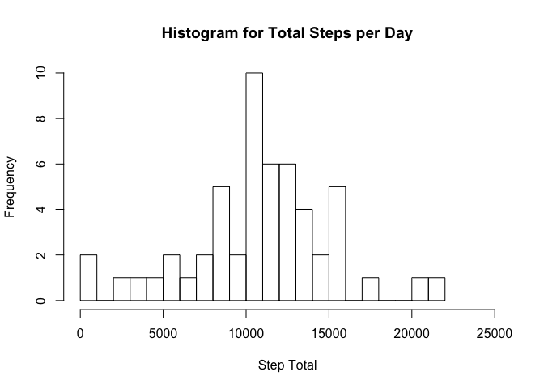
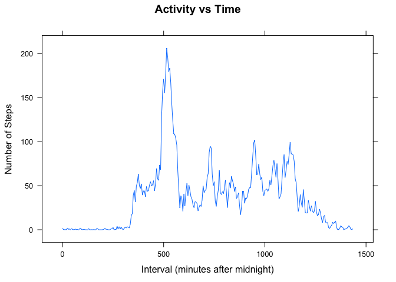
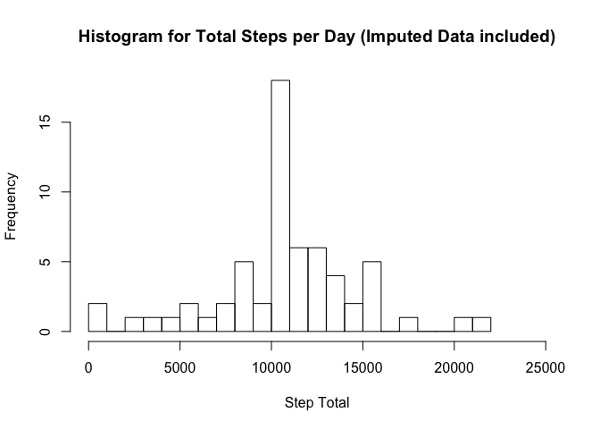
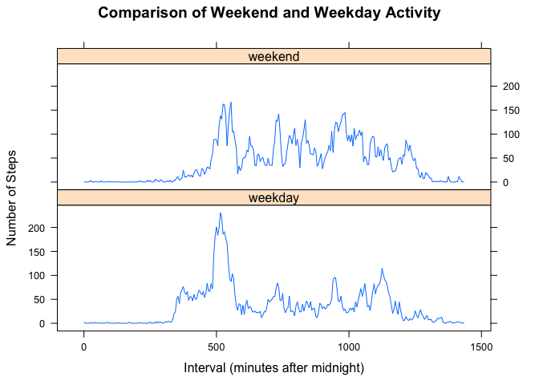

# Reproducible Research: Peer Assessment 1
## Summary

* Author: Ian Grundy
* Date: 20 September 2015
* Dataset: Activity monitoring data [52K], consisting of 17568 observations in 3 columns
* Variables:
     * steps: Number of steps taking in a 5-minute interval (missing values are coded as NA)
     * date: The date on which the measurement was taken in YYYY-MM-DD format
     * interval: Identifier for the 5-minute interval in which measurement was taken, in HHMM format.

## Introduction

This project analyses data collected from a personal activity monitoring device. The data consists of two months of data from an anonymous individual collected during the months of October and November, 2012 and include the number of steps taken in 5 minute intervals each day.

## Loading and preprocessing the data

### Loading the data

We first load some relevant libraries and the data from the given .zip file. If the file does not exist in the working folder it is sourced from the web.


```r
library(dplyr)
library(tidyr)
library(ggplot2)
library(lattice)
library(reshape2)

fileURL <- "https://d396qusza40orc.cloudfront.net/repdata%2Fdata%2Factivity.zip"
 
if (!file.exists("./activity.zip"))
{  
    cat("Downloading data set")
    download.file(fileURL, destfile="./activity.zip", method="curl")
    unzip("./activity.zip")
    cat("   ... downloaded and unzipped\n")
}
```

```
## Downloading data set   ... downloaded and unzipped
```
The zip file contains a .csv data file named `activity.csv`. Data from this file is read into the `activitydata` data table, which is then converted to a data frame of the same name.

```r
activitydata <- read.csv("activity.csv", colClasses = c("numeric","character","numeric"), na.strings="NA", header=TRUE)
activitydata <- as.data.frame(activitydata)
```

### Pre-processing the data

The interval column contains time information of the form HHMM. This is not strictly a numeric variable because of the jump from MM=55 to MM=00. Consequently, I have chosen to create a new "continuous" variable `interval_minutes` which gives each time point as the number of minutes after 12 midnight. An `interval_minutes` column is appended to `activitydata`. The change is most apparent at line 13 in the output.

```r
hours <- activitydata$interval %/% 100
minutes <- activitydata$interval %% 100
interval_minutes <- 60*hours + minutes
activitydata <- mutate(activitydata, interval_minutes = as.numeric(interval_minutes))
print(head(activitydata,20))
```

```
##    steps       date interval interval_minutes
## 1     NA 2012-10-01        0                0
## 2     NA 2012-10-01        5                5
## 3     NA 2012-10-01       10               10
## 4     NA 2012-10-01       15               15
## 5     NA 2012-10-01       20               20
## 6     NA 2012-10-01       25               25
## 7     NA 2012-10-01       30               30
## 8     NA 2012-10-01       35               35
## 9     NA 2012-10-01       40               40
## 10    NA 2012-10-01       45               45
## 11    NA 2012-10-01       50               50
## 12    NA 2012-10-01       55               55
## 13    NA 2012-10-01      100               60
## 14    NA 2012-10-01      105               65
## 15    NA 2012-10-01      110               70
## 16    NA 2012-10-01      115               75
## 17    NA 2012-10-01      120               80
## 18    NA 2012-10-01      125               85
## 19    NA 2012-10-01      130               90
## 20    NA 2012-10-01      135               95
```
There are many missing values in the `steps` column of the data frame. We create a new data frame named `stepdata` with missing data removed.

```r
stepdata <- activitydata[!is.na(activitydata$steps),]
```

## What is mean total number of steps taken per day?

### Step Distribution

The five-minute step totals are summed into daily step totals which are then placed in the steps column of the data frame `step_total_columns`, from which a histogram is generated.

```r
step_totals <- tapply(stepdata$steps, stepdata$date, sum)
step_total_columns <- data.frame(date=names(step_totals),sum=step_totals)
print(head(step_total_columns,10), row.names = FALSE)
```

```
##        date   sum
##  2012-10-02   126
##  2012-10-03 11352
##  2012-10-04 12116
##  2012-10-05 13294
##  2012-10-06 15420
##  2012-10-07 11015
##  2012-10-09 12811
##  2012-10-10  9900
##  2012-10-11 10304
##  2012-10-12 17382
```

```r
hist(step_total_columns$sum, xlim = c(0,25000), breaks = 20, main="Histogram for Total Steps per Day", xlab="Step Total") 
```

 

The step distribution is reasonably symmetrical with its mean and median being very close in value. 

```r
cat("mean =", mean(step_total_columns$sum))
```

```
## mean = 10766.19
```

```r
cat("median =", median(step_total_columns$sum))
```

```
## median = 10765
```

## What is the average daily activity pattern?

### Daily Activity Pattern

We calculate the daily activity pattern by averaging the number of steps taken during each time interval, across every day in the data set. The step averages are first placed in the data frame `step_average_columns`.

```r
step_averages <- tapply(stepdata$steps, stepdata$interval_minutes, mean)
step_average_columns <- data.frame(interval_minutes=as.numeric(names(step_averages)),mean=step_averages)
print(head(step_average_columns,10), row.names = FALSE)
```

```
##  interval_minutes      mean
##                 0 1.7169811
##                 5 0.3396226
##                10 0.1320755
##                15 0.1509434
##                20 0.0754717
##                25 2.0943396
##                30 0.5283019
##                35 0.8679245
##                40 0.0000000
##                45 1.4716981
```
We then use the `lattice` graphics command `xyplot` to plot the average step time series:

```r
print(xyplot(data = step_average_columns, mean ~ interval_minutes, type="l", main = "Activity vs Time", ylab = "Number of Steps", xlab="Interval (minutes after midnight)"))
```

 

```r
max_steps <- max(step_average_columns$mean)
max_interval <- step_average_columns[step_average_columns$mean == max_steps,1]
cat("max_steps =",max_steps, ", max_interval =",max_interval)
```

```
## max_steps = 206.1698 , max_interval = 515
```
The 5-minute interval which, on average across all the days in the dataset, contains the maximum number of steps (206.1698113) is 515 minutes after midnight (or time `0835`).

## Imputing missing values

### Missing Values

There are a number of days/intervals which contain missing values (coded as NA) of the `steps` variable. 
In order to remove any bias generated by these missing values, we first determine how many missing values appear:

```r
missing_data_count <- nrow(activitydata[!complete.cases(activitydata),])
cat("number of missing values =", missing_data_count)
```

```
## number of missing values = 2304
```
Thus there are 2304 rows out of 17568 which contain missing values.

### Strategy for Replacing Missing Values

The strategy here for handling missing values in the `steps` column is to replace each of them by the mean number of steps (across all days) at that particular interval of time. This strategy was chosen because it (a) is easy to implement and (b) acknowledges the wide variability of the average number of steps across each 24 hour period. 

The `activitydata` and `step_average_columns` data frames are merged on the `interval_minutes` variable. This has the effect of appending a column of average steps for each time interval to the `activitydata` data frame. A loop is then used (sadly) to replace each missing value in the `steps` column by its corresponding average. Since the output of the `merge` operation is unordered, the merged data frame must be re-sorted by `date` and `time`.


```r
total <- merge(activitydata, step_average_columns, by="interval_minutes")
n <- nrow(total)
for (i in 1:n)
{
    if ( is.na(total$steps[i]))
    {
       total$steps[i] <- total$mean[i]
    }
}
fulldata <- total[order(total$date,total$interval),]
print(head(fulldata), row.names = FALSE)
```

```
##  interval_minutes     steps       date interval      mean
##                 0 1.7169811 2012-10-01        0 1.7169811
##                 5 0.3396226 2012-10-01        5 0.3396226
##                10 0.1320755 2012-10-01       10 0.1320755
##                15 0.1509434 2012-10-01       15 0.1509434
##                20 0.0754717 2012-10-01       20 0.0754717
##                25 2.0943396 2012-10-01       25 2.0943396
```

### Data Set with Imputed Missing Values

`fulldata` is a new data frame which is equal (give or take an extra column or two) to the original dataset but with the missing data filled in. We now repeat the steps above (in the Steps Distribution section) to produce a histogram of the total number of steps for the "filled in" data set `fulldata`:


```r
full_step_totals <- tapply(fulldata$steps, fulldata$date, sum)
full_step_total_columns <- data.frame(date=names(full_step_totals),sum=full_step_totals)
hist(full_step_total_columns$sum, xlim = c(0,25000), breaks = 20, main="Histogram for Total Steps per Day (Imputed Data included)", xlab="Step Total") 
```

 

The step distribution for `fulldata` is now slightly more symmetrical than before. The mean and median are now identically equal to the mean value found above. 

```r
cat("mean =", mean(full_step_total_columns$sum))
```

```
## mean = 10766.19
```

```r
cat("median =", median(full_step_total_columns$sum))
```

```
## median = 10766.19
```

## Are there differences in activity patterns between weekdays and weekends?

### Comparison of Weekday and Weekend Activity

We explore the differences in activity patterns between weekdays and weekends by appending a new factor variable in the dataset with two levels – “weekday” and “weekend” to indicate whether a given date is a weekday or weekend day. The new factor `newcol` takes each element in the `date` column of `fulldata` and then converts it to a day of the week. A loop (sadly, again) is used to convert each day of the week to either `weekday` or `weekend`. This column is then appended to `fulldata` to create the data frame `augdata`.


```r
newcol <- weekdays(as.Date(as.character(fulldata$date)))
for (i in 1:n)
{
    if ( newcol[i] %in% c("Saturday","Sunday") )
    {
       newcol[i] <- "weekend"
    }
    else
    {
       newcol[i] <- "weekday"
    }
}
augdata <- mutate(fulldata,day=as.character(newcol))
print(head(augdata), row.names = FALSE)
```

```
##  interval_minutes     steps       date interval      mean     day
##                 0 1.7169811 2012-10-01        0 1.7169811 weekday
##                 5 0.3396226 2012-10-01        5 0.3396226 weekday
##                10 0.1320755 2012-10-01       10 0.1320755 weekday
##                15 0.1509434 2012-10-01       15 0.1509434 weekday
##                20 0.0754717 2012-10-01       20 0.0754717 weekday
##                25 2.0943396 2012-10-01       25 2.0943396 weekday
```
The step averages at each time interval are then computed separately for weekdays and weekends:


```r
separate_step_averages <- tapply(augdata$steps, list(augdata$interval_minutes, augdata$day), mean)
separate_step_averages_columns <- data.frame(interval_minutes=as.numeric(rownames(separate_step_averages)),separate_step_averages)
colnames(separate_step_averages_columns)[1]="interval_minutes"
print(head(separate_step_averages_columns), row.names = FALSE)
```

```
##  interval_minutes    weekday     weekend
##                 0 2.25115304 0.214622642
##                 5 0.44528302 0.042452830
##                10 0.17316562 0.016509434
##                15 0.19790356 0.018867925
##                20 0.09895178 0.009433962
##                25 1.59035639 3.511792453
```
This data frame is then melted to form the data frame `ssac` in which the weekend and weekday columns are transformed to values of a single `day` variable:


```r
ssac <- melt(separate_step_averages_columns, id.vars="interval_minutes", variable.name = "day", value.name = "steps")
print(head(ssac), row.names = FALSE)
```

```
##  interval_minutes     day      steps
##                 0 weekday 2.25115304
##                 5 weekday 0.44528302
##                10 weekday 0.17316562
##                15 weekday 0.19790356
##                20 weekday 0.09895178
##                25 weekday 1.59035639
```
In this form, a panel plot may now be created for the separate weekend and weekday time series.


```r
print(xyplot(data = ssac, steps ~ interval_minutes | day, type="l", layout=c(1,2), main = "Comparison of Weekend and Weekday Activity", ylab = "Number of Steps", xlab="Interval (minutes after midnight)"))
```

 

In the plot shown above we observe that weekend activity starts later, and appears to be generally higher, than weekday activity, except for the peak at around 8:35 am on weekdays (when the subject is presumably travelling to work). If one was brave, he/she might speculate that individual in question has an active weekend social life and a relatively sedentary weekday job.

